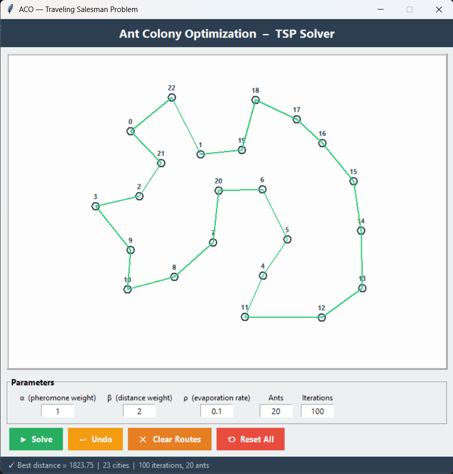

# 🐜 ACO-TSP — Ant Colony Optimization for the Traveling Salesman Problem

[](https://www.python.org/)
[](LICENSE)
[](https://peps.python.org/pep-0008/)

A clean, well-documented Python implementation of the **Ant Colony System (ACS)** metaheuristic applied to the classic **Traveling Salesman Problem (TSP)**, featuring an interactive **Tkinter GUI** for real-time city placement and route visualization.

### Example: Optimized Route for 23 Cities



---

## Table of Contents

- [Features](#-features)
- [How It Works](#-how-it-works)
- [Project Structure](#-project-structure)
- [Installation](#-installation)
- [Usage](#-usage)
- [Algorithm Parameters](#-algorithm-parameters)
- [Examples](#-examples)
- [Testing](#-testing)
- [Contributing](#-contributing)
- [License](#-license)

---

## ✨ Features

| Feature | Description |
|---|---|
| **Interactive GUI** | Click to place cities on a canvas; run the solver and see the route drawn in real time |
| **Headless / Library mode** | Use the solver programmatically in your own scripts |
| **Convergence plotting** | Matplotlib dashboard showing the best tour and convergence curve |
| **Configurable parameters** | Tune α, β, ρ, number of ants, and iterations from the GUI or CLI |
| **Reproducible results** | Optional random seed support for deterministic runs |
| **Clean architecture** | Fully typed, documented, PEP 8–compliant codebase |

---

## 🧠 How It Works

The **Ant Colony Optimization** algorithm is a nature-inspired metaheuristic based on the foraging behaviour of real ants:

1. **Initialization** — A complete graph is built from *N* cities. All edges start with equal pheromone levels.
2. **Tour Construction** — Each ant starts at a random city and builds a complete tour by probabilistically choosing the next city based on:

$$P_{ij} = \frac{\tau_{ij}^{\alpha} \cdot \eta_{ij}^{\beta}}{\sum_{k \in \text{unvisited}} \tau_{ik}^{\alpha} \cdot \eta_{ik}^{\beta}}$$

   where $\tau_{ij}$ is the pheromone level and $\eta_{ij} = \bar{d} / d_{ij}$ is the heuristic desirability (inverse distance).

3. **Pheromone Evaporation** — After all ants complete their tours, pheromone decays globally:

$$\tau_{ij} \leftarrow (1 - \rho) \cdot \tau_{ij}$$

4. **Pheromone Deposit** — Ants deposit pheromone on edges they traversed, proportional to tour quality (shorter tours deposit more).
5. **Iteration** — Steps 2–4 repeat for a fixed number of iterations. The best tour found across all iterations is returned.

---

## 📁 Project Structure

```
ACO-TSP/
├── aco_tsp/                  # Core Python package
│   ├── __init__.py           # Package metadata & public API
│   ├── core.py               # Node, Edge, Graph, Ant, ACO classes
│   ├── gui.py                # Interactive Tkinter application
│   └── visualization.py      # Matplotlib plotting utilities
├── examples/
│   └── solve_custom_cities.py # Example: solve a custom TSP instance
├── tests/
│   └── test_core.py          # Unit tests (pytest)
├── Canevas.py                # Main entry point — launches the GUI
├── main.py                   # CLI entry point (GUI / demo modes)
├── requirements.txt
├── pyproject.toml
├── LICENSE
├── .gitignore
└── README.md
```

---

## 🚀 Installation

### Prerequisites

- **Python 3.9+**
- **Tkinter** (included with most Python distributions)

### Steps

```bash
# 1. Clone the repository
git clone https://github.com/<your-username>/ACO-TSP.git
cd ACO-TSP

# 2. (Recommended) Create a virtual environment
python -m venv .venv
source .venv/bin/activate      # Linux / macOS
.venv\Scripts\activate         # Windows

# 3. Install dependencies
pip install -r requirements.txt
```

---

## 🎮 Usage

### Interactive GUI

```bash
python Canevas.py
```

1. **Click** anywhere on the white canvas to place cities.
2. **Adjust** parameters (α, β, ρ, ants, iterations) in the input fields.
3. Press **▶ Solve** to run the ACO algorithm.
4. The best route is drawn on the canvas and the distance shown in the status bar.
5. Use **↩ Undo**, **✕ Clear Routes**, or **⟲ Reset All** to modify the layout.

### Headless Demo

```bash
python main.py --demo --cities 20 --seed 42
```

Or use the original entry point:

```bash
python Canevas.py
```

This generates random cities, runs the solver, and displays a Matplotlib dashboard with the tour and convergence curve.

### Library Usage

```python
from aco_tsp.core import Node, Graph, ACO
from aco_tsp.visualization import plot_dashboard

Node.reset_counter()
nodes = [Node(0, 0), Node(3, 4), Node(6, 0), Node(3, -4)]
graph = Graph(nodes, seed=42)
aco = ACO(graph, seed=42)

path, distance, convergence = aco.solve(
    alpha=1, beta=3, rho=0.1,
    n_ants=20, n_iterations=100,
)

plot_dashboard(path, convergence, distance)
```

---

## ⚙️ Algorithm Parameters

| Parameter | Symbol | Default | Description |
|---|---|---|---|
| `alpha` | α | 1.0 | Pheromone importance — higher values make ants follow established trails more |
| `beta` | β | 2.0 | Distance importance — higher values make ants prefer shorter edges |
| `rho` | ρ | 0.1 | Evaporation rate — controls how fast pheromone decays (0 = no decay, 1 = full reset) |
| `n_ants` | — | 20 | Number of ants per iteration |
| `n_iterations` | — | 100 | Total number of optimization iterations |

**Tuning tips:**
- Increase **β** (e.g. 3–5) for faster convergence to good solutions.
- Lower **ρ** (e.g. 0.05) to let pheromone trails persist longer.
- Use more ants for larger instances (rule of thumb: ≈ number of cities).

---

## 📝 Examples

See the [`examples/`](examples/) directory:

- **`solve_custom_cities.py`** — Define your own city coordinates and solve programmatically.

Run it with:

```bash
python examples/solve_custom_cities.py
```

---

## 🧪 Testing

```bash
# Install test dependencies
pip install pytest

# Run all tests
pytest tests/ -v
```

---

## 🤝 Contributing

Contributions are welcome! Feel free to:

1. Fork the repository
2. Create a feature branch (`git checkout -b feature/my-feature`)
3. Commit your changes (`git commit -m "Add my feature"`)
4. Push to the branch (`git push origin feature/my-feature`)
5. Open a Pull Request

---

## 📄 License

This project is licensed under the [MIT License](LICENSE).

---

<p align="center">
  <i>Built with Python • Inspired by nature 🐜</i>
</p>
